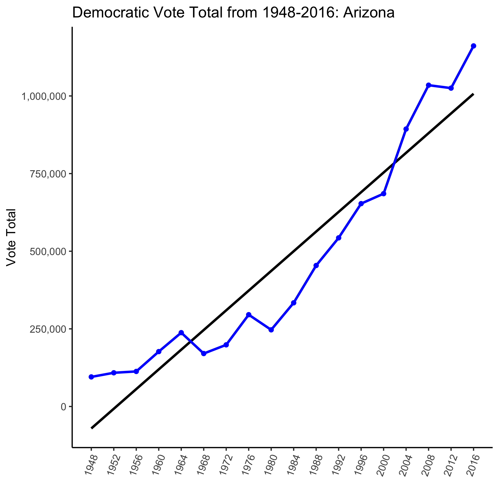
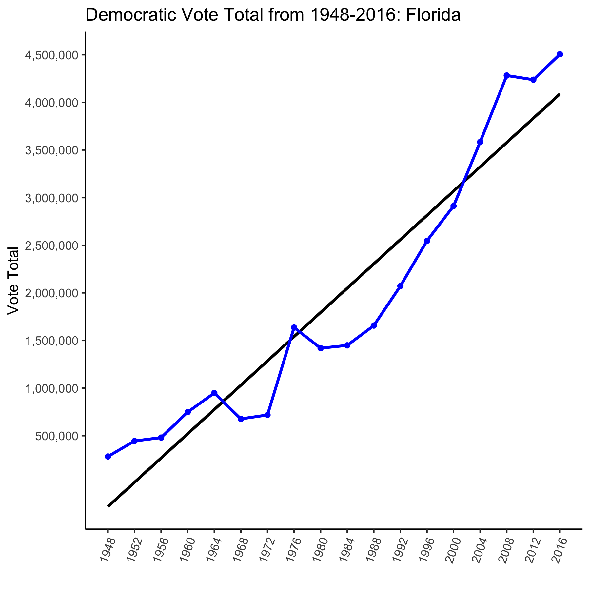
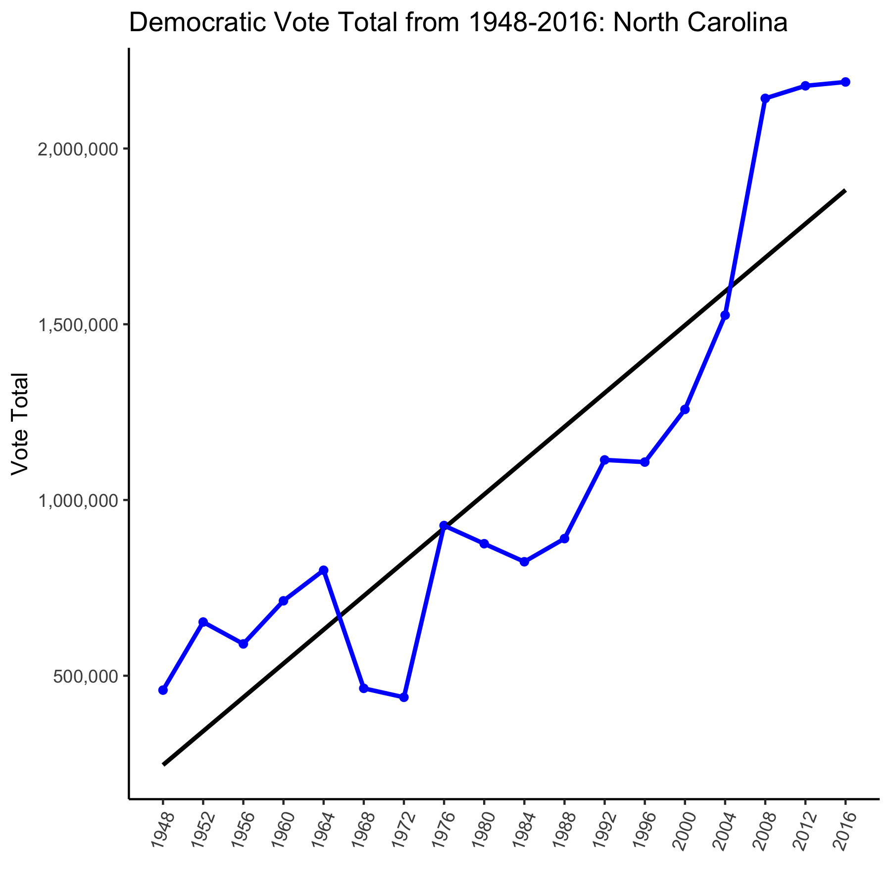

# Introduction: September 12, 2020

When one looks at the 2016 election, they are either overwhelmed with confidence or overwhelmed with a sense of dread. Though current President Donald Trump won the Electoral College, he lost the popular vote, pointing to a demographic difference between the Electoral College and the American public. One way that the 2020 election is going to be determined is through battleground states, or less predictable “swing” states that are not guaranteed to go to either party in a given year. According to Ballotpedia, [12 states determined the 2016 election](https://ballotpedia.org/Presidential_battleground_states,_2016). Among those are Arizona, North Carolina, and Florida -- these three states are also considered battleground states in 2020. Through analysis of registered voters in 2016 and 2020, it can be argued that these three states are on the Democratic rise, due to demographic changes, a shift in candidate favorability, and a positive increase in Democratic voter turnout.

# Arizona
According to the [Arizona Secretary of State](https://azsos.gov/about-office/media-center/press-releases/1061), Arizona has 3.87 million registered voters, with 1,347,101 active registered Republican voters and 1,207,014 active registered Democratic voters. However, there are 1,282,043 active registered Independent voters, which highlights the sheer competitiveness of Arizona in the Electoral College. According to the [Encyclopedia Britannica](https://www.britannica.com/topic/United-States-presidential-election-of-2016), Arizona has 11 Electoral College votes, and while all 11 votes went to Republican nominee Donald J. Trump in 2016, he only [won by 4 points](https://fivethirtyeight.com/features/how-arizona-became-a-swing-state/).The state also elected four Democratic candidates in statewide races in 2018, and, as of September 2020, Joe Biden leads Trump by 5.3 points in [FiveThirtyEight’s Arizona polling average](https://projects.fivethirtyeight.com/polls/president-general/arizona/).Arizona is undeniably at play in the 2020 election, and this is partly because of the [increase in Latinx voters](https://fivethirtyeight.com/features/how-arizona-became-a-swing-state/) -- the state has gone from 25% Latinx in 2000 to 31% in 2020.This increase in Democratic votes, as shown in the graphic below, makes Arizona a key battleground state to watch in 2020.

# Florida
Since the Bush v. Gore Presidential Election in 2000, Florida has been considered a swing state. In 2008 and 2012, Florida voters picked [Democratic Nominee Barack Obama]( https://fivethirtyeight.com/features/why-florida-could-go-blue-in-2020/). But in 2016, Hillary Clinton lost Florida by 1.2 points, or [113,000 votes](../data/popvote_bystate_1948-2016.csv). As you can see in the graphic below, Florida has had a steady increase in Democratic voters, despite the results of the 2018 midterms. According to [FiveThirtyEight](https://fivethirtyeight.com/features/why-florida-could-go-blue-in-2020/), in 2018, “Republican Rick Scott defeated incumbent Democratic Sen. Bill Nelson by 0.1 points, and Republican Ron DeSantis defeated Democrat Andrew Gillum by 0.4 points.” These results may cause some Democrats to be concerned about their chances of winning in 2020, but according to the Benenson Strategy Group’s most recent poll, Biden is [2 points ahead of Trump]( https://projects.fivethirtyeight.com/polls/florida/) with likely voters. This favorability rating is far higher than Clinton’s in September of 2016 according to an Ipsos poll that had [Trump ahead 5 points](https://projects.fivethirtyeight.com/2016-election-forecast/florida/) with likely voters. Though one should not “ride the pollercoaster,” I believe this shows the rise in Democratic voters in Florida between 2016 and 2020.

# North Carolina

In 2016, all 15 of North Carolina’s Electoral College votes went to [Trump](https://www.britannica.com/topic/United-States-presidential-election-of-2016). 8 years earlier, in 2008, Democratic nominee Barack Obama narrowly defeated Republican nominee John McCain by [.32 points]( https://er.ncsbe.gov/?election_dt=11/04/2008&county_id=0&office=FED&contest=0). Though Democrats lost in 2016, as shown in the graphic below, there are an increasing number of Democratic voters. According to the [North Carolina State Board of Elections](https://vt.ncsbe.gov/RegStat/Results/?date=09%2F05%2F2020), as of September 5, 2020, there are 2,549,307 registered Democratic voters and 2,134,217 registered Republican voters. Though North Carolina leans relatively conservative in comparison to the rest of the nation (+6.3 points according to [FiveThirtyEight](https://fivethirtyeight.com/features/new-polling-shows-trumps-electoral-college-advantage-is-slipping/) polling in June 2020), Biden was leading by 3.2 points in that same poll. Though North Carolina has not given its 15 Electoral Votes to a Democrat in over ten years, the graphic below and the number of registered Democratic voters show a positive lean in favor of the left.

# Conclusion

In conclusion, one can argue that of the twelve battleground states, Arizona, North Carolina, and Florida are on track to vote for Joe Biden in the 2020 presidential election. As shown in the graphics, all three states are on a Democratic rise, but I believe that Arizona is the battleground state most likely to lean blue in 2020. Due to an increase in Latinx voters, a clear “blue wave” in the 2018 midterms, and a strong Democratic candidate for Senate (astronaut Mark Kelly), who, according to a poll released by the [Benenson Strategy Group](https://projects.fivethirtyeight.com/polls/senate/arizona/), is ahead of incumbent Martha McSally by 3 points, I believe that Democrats and the Biden campaign are in a great place to win Arizona in 2020.
